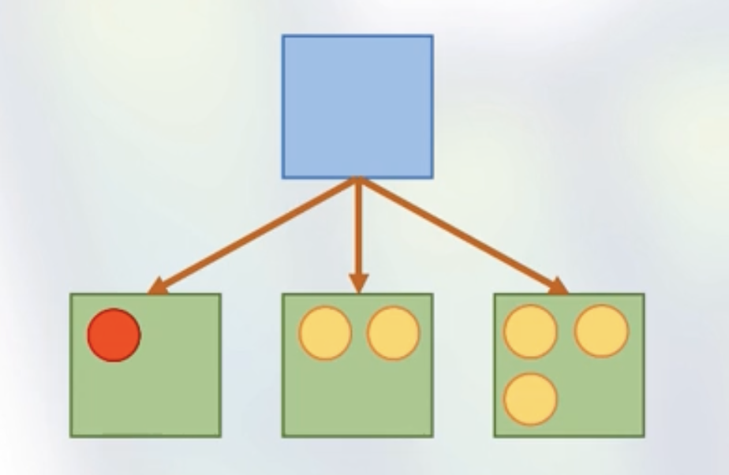
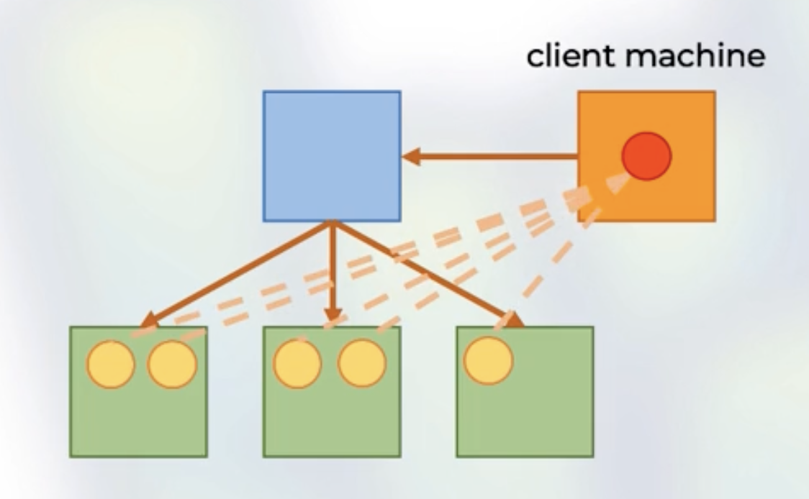

# Rock The JVM - Spark Essentials

## Architecture

### Low-level APIs
* RDDs
* Distributed variables

### High-level APIs
* DataFrames
* Datasets
* Spark SQL

### Applications
* Streaming
* ML
* GraphX
* Other Libraries

## Spark Cluster Manager
* One node manages the state of the Cluster, the others do the work.
* Communicates via driver/worker processes.
* Standalone, YARN, Mesos

## Spark Driver
* Manages the state of stages/tasks of the application.
* Interfaces with the Cluster Manager.

## Spark Executors
* Runs the tasks assigned by the Spark Driver.
* Reports their state and results to the Driver.

## Spark Processes
* Driver
* Executors

## Execution Mode

### Cluster Mode
* The Spark driver is launched on a worker node
* The cluster manager is responsible for Spark processes

### Client Mode
* The Spark driver is on the client machine
* The client is responsible for the Spark processes and state management

### Local Mode
* The entire process runs locally
* The paralelism is based on cores number

### Execution Terminology
A `job` has multiple `stages`, a `stage` has multiple `tasks`.

* `stage` = a set of computations between shuffles.
* `task` = a unit of computation, per partition.
* `DAG` = "directed acyclic graph" of RDD dependencies

* `shuffle` = exchange of data between spark nodes.